# 大连实训 - 电商零售大数据分析
###### 建议使用自己的电脑，尤其是环境配置，提供电脑不足以带动多个虚拟机

## 2024.07.22-2024.07.23 环境等的安装与配置
**创建虚拟机**
1. 无脑安装VMware WorkStation Pro，自己电脑个人建议根据习惯修改安装路径
2. 安装好以后打开并新建虚拟机，执行下列但不仅限于本步骤时，注意自己的磁盘空间是否充足
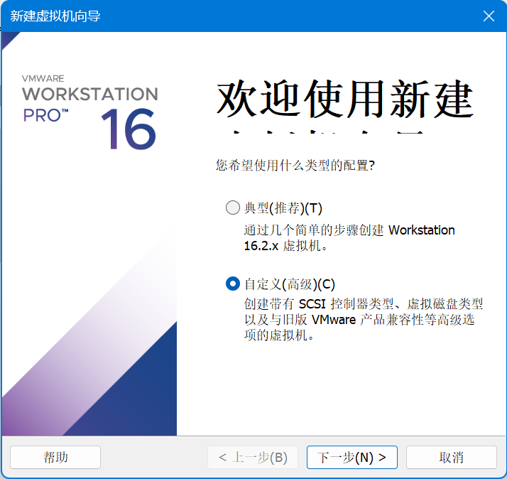
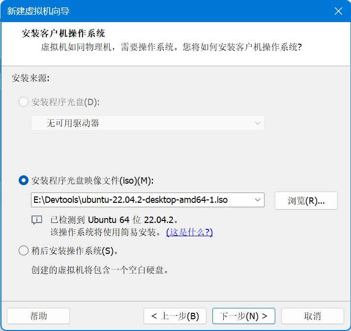
比如LinuxName admin password password
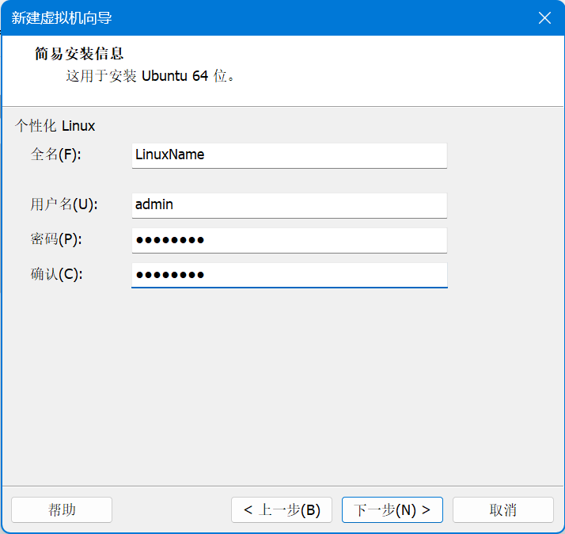
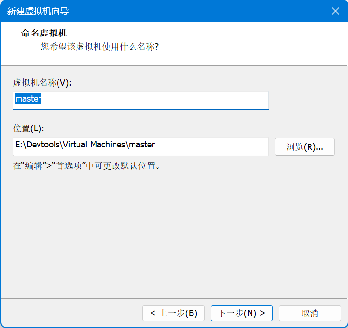
处理器配置和虚拟机内存可能要根据实际环境调整

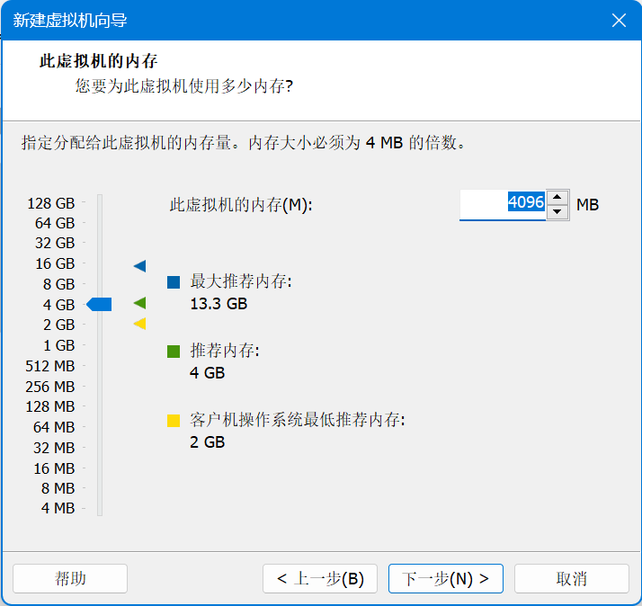
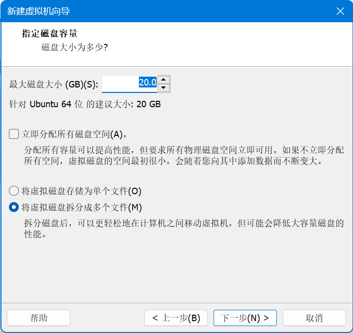
3. 虚拟机新建成功，进入虚拟机界面
   - 依然是不说明就点下一步
   - 第一步：不要选汉化，默认英文即可
   - 第二步：Updates and other software里的四个框只选第一个，取消第三个勾选是为了减少不必要的安装时间，也可以勾选但是安装时间很长
   - 创建用户我个人选择自动登录
4. 虚拟机克隆
   - 克隆之前先关闭虚拟机
   - 选择创建完整克隆
   - 仍然注意磁盘空间

**基础网络环境配置**
1. 设置三台虚拟机的hostname
   - 运行master虚拟机为例，打开terminal，输入sudo vi /etc/hostname，注意vi后面有空格
   - 输入密码，不可见，输入后回车就ok
   - delete删除原名字
   - 单击insert进入编辑模式，输入要修改的名字，比如master
   - 回车，再单击esc，再输入:wq，回车保存并退出
   - 回到了命令行发现@后还是原来的名字，我的是fanzong-virtual-machine
   - 重新启动虚拟机就好了，命令sudo reboot或者手动重启
   - 另外两台虚拟机运行后步骤如上，依次修改三台的hostname
2. 设置三台虚拟机的hosts
   - 三台机器都要设置 也就是3*3个命令输入
   - 我按照老师给的用vi编辑会出现输入内容cv一大堆的问题，至今未解之谜
   - 我将vi换成nano，输入三行命令以后，ctrl+o保存，回车确认，ctrl+x退出，问题完美解决
   - 搞定后可以同样的命令检查设置成功与否
3. 配置静态ip，直接按照老师给的步骤，不用输入命令，在桌面图形化界面做，除了Address三个虚拟机不一样填的其他都一样
 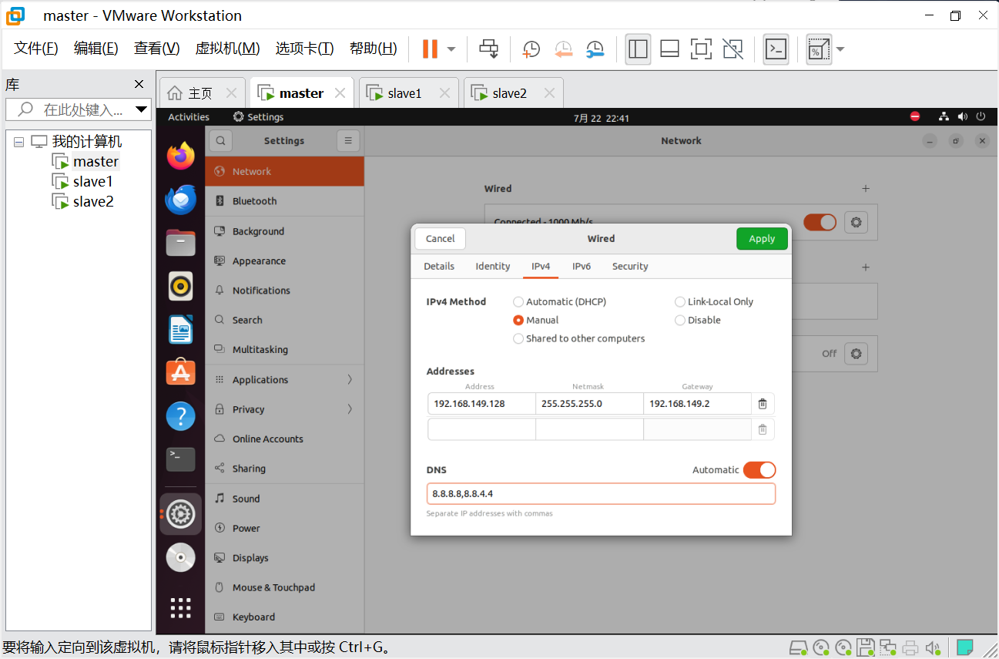
4. 设置子网ip
   编辑 -> 虚拟网络编辑器 -> 选择VMnet08 -> 更改设置 -> 子网ip改为192.168.149.0

**免密通信**
1. 三台虚拟机都输入
   ```
   sudo apt-get install ssh
   ssh-keygen -t rsa 一路回车（前面不要加 sudo）
   ```
2. slave1输入/slave2输入
   ```
   scp .ssh/id_rsa.pub fanzong@master:/home/fanzong/id_rsa1.pub
   ```
   fanzong部分改成自己的，不知道的看一下master -> terminal 绿色字
3. 在master输入如下
   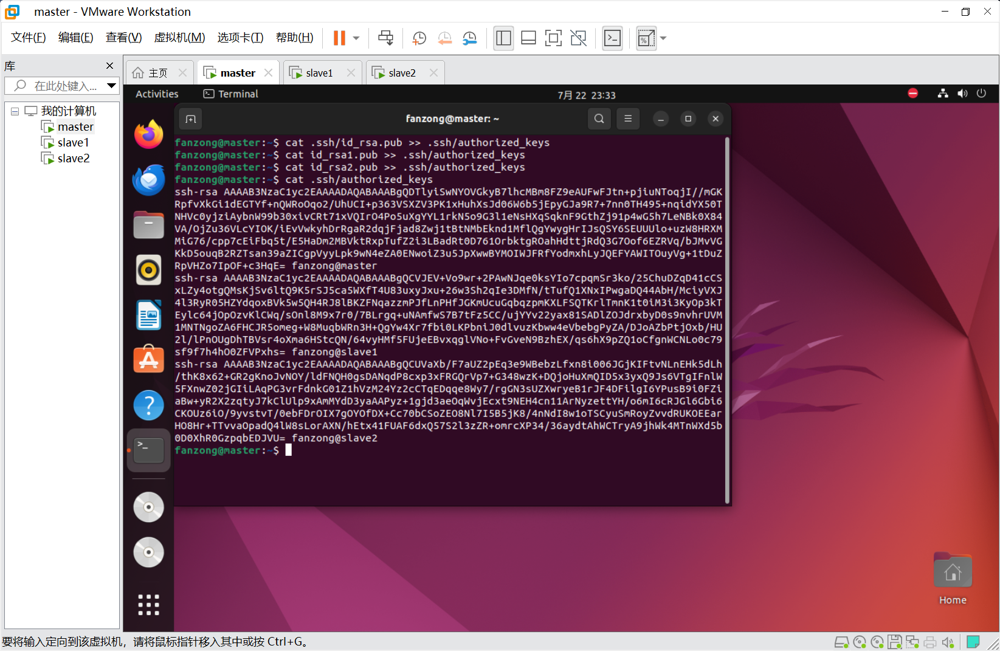
   
4. 可以通过cat命令验证三个节点都有三份公钥

**hadoop配置与使用**
1. 三台虚拟机都输入
   
   ```
   mkdir data
   mkdir data/namenode
   mkdir data/datanode
   mkdir data/tmp
   ```
2. 三个节点都上传jdk并解压，**<span style="color:red">注意命令行在哪里</span>**，同理在master上传hadoop
   ```
   scp E:/Devtools/jdk-8u191-linux-x64.tar.gz fanzong@master:/home/fanzong/
   ```
   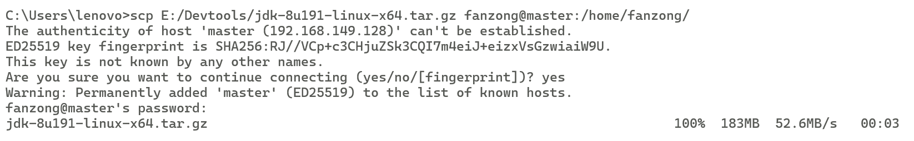
   ```
   cd /home/fanzong
   ```
   ```
   tar -xzvf jdk-8u191-linux-x64.tar.gz
   ```
   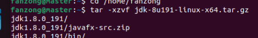
3. master节点输入，修改一系列配置文件，**<span style="color:red">注意自己的命名是否一致</span>**
   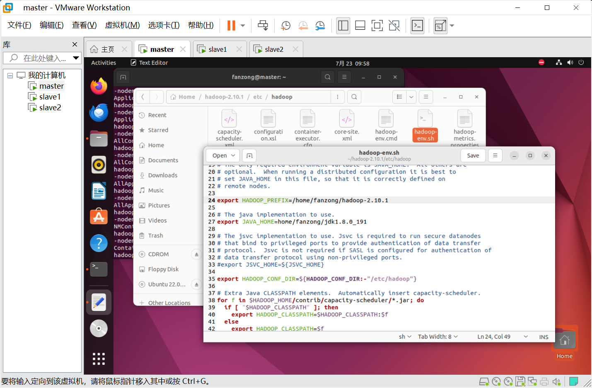
4. 三个节点都要修改，**<span style="color:red">血泪的教训</span>**，这里需要保证前一步配置文件修改没有问题，尤其不要少路径开头的/
   ```
   sudo nano /etc/profile
   ```
 
   
   ``` 
   追加到文件末尾
   # Define JAVA_HOME and JRE_HOME
   export JAVA_HOME=/home/fanzong/jdk1.8.0_191
   export JRE_HOME=$JAVA_HOME/jre

   # Define HADOOP_HOME
   export HADOOP_HOME=/home/fanzong/hadoop-2.10.1

   # Define CLASSPATH
   export CLASSPATH=.:$JAVA_HOME/lib/dt.jar:$JAVA_HOME/lib/tools.jar:$HADOOP_HOME/share/hadoop/common/hadoop-common-2.10.1.jar:$HADOOP_HOME/share/hadoop/mapreduce/hadoop-mapreduce-client-core-2.10.1.jar:$HADOOP_HOME/share/hadoop/common/lib/commons-cli-1.2.jar

   # Define PATH
   export PATH=$JAVA_HOME/bin:$JRE_HOME/bin:$HADOOP_HOME/sbin:$HADOOP_HOME/bin:$PATH

   ```
   验证过程中如果不能直接运行version查看命令，先重启VM再试，依然错说明配置有问题，回头检查一下
   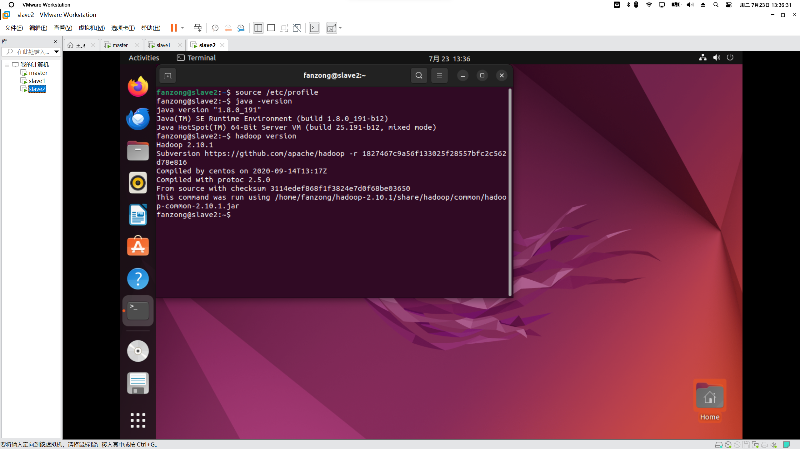
5. hadoop发送到slave1 slave2
   ```
   scp -r hadoop-2.10.1/ fanzong@slave1:/home/fanzong
   ```
6. 格式化HDFS
   - 启动 hadoop 集群（在 master 节点上）：$ start-dfs.sh
   - 查看进程：$jps
   - 如果正确
     - 在主节点能够看到 NameNode
     - 在 slave1 上能够看到 SecondaryNameNode DataNode
     - 在 slave2 上能够看到 DataNode

   - 如果不正确，需要重新格式化，注意，格式化前需要在3台机器删除data目录，在3台机器上重新执行以下，然后再 hdfs namenode -format ：
      ```
      mkdir data
      mkdir data/namenode
      mkdir data/datanode
      mkdir data/tmp
      ```
7. 测试
   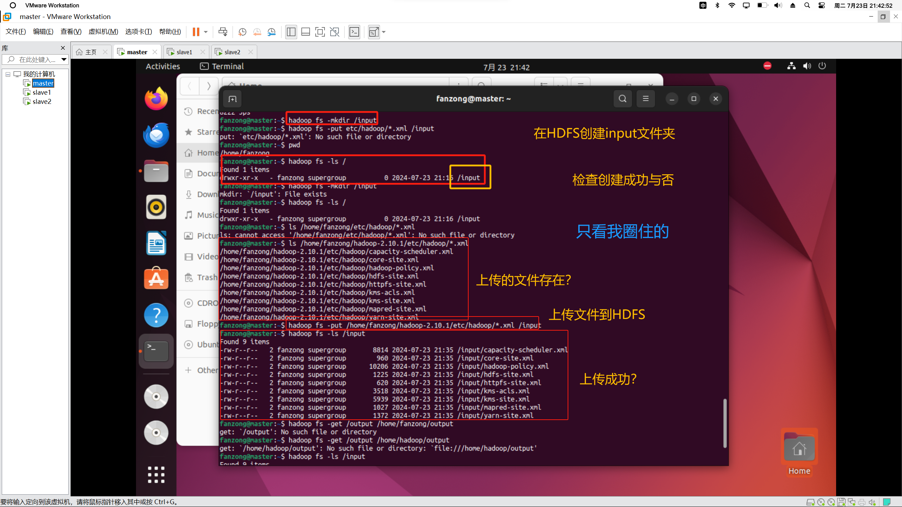
   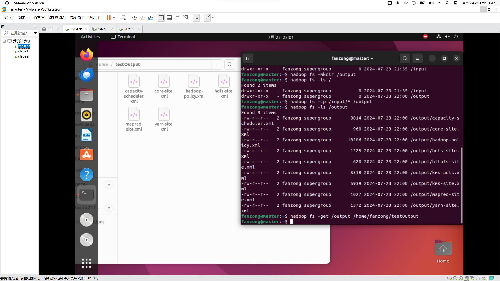


**Spark配置与使用**
1. 自行下载 发送 解压 步骤如之前
2. sudo chown -R fanzong ./spark
3. 配置文件修改
   ```
   sudo nano /etc/profile
   ```
   ```
   export SPARK_HOME=/usr/local/spark
   export PATH=$PATH:$SPARK_HOME/bin:$SPARK_HOME/sbin
   ```
   ```
   source /etc/profile
   ```
4. 
   ```
   cd /home/fanzong/spark
   cp ./conf/spark-env.sh.template ./conf/spark-env.sh #拷贝配置文件
   ```
5. 修改sh文件：
   ```
   export SPARK_DIST_CLASSPATH=$(/home/fanzong/hadoop/bin/hadoop classpath)
   ```
6. 
   ```
   spark-submit --version #验证是否安装成功
   spark-shell
   val hdfsFile = "hdfs://namenode:8020/user/hadoop/input/data.txt"
   val data = sc.textFile(hdfsFile)
   data.collect().foreach(println)
   ```

##  2024.07.24 项目实战-确定思路及相关配置
1. 整体思路
   - 数据收集和存储：将电商平台的数据收集并存储在 HDFS 中，方便后续处理。
   - 数据处理和分析：使用 Spark 进行数据处理和分析，生成所需的结果。
   - 数据可视化：将处理后的数据导出并使用 ECharts 进行可视化。
2. 实现方法
   - 方案一    
     - 虚拟机 1 负责数据的收集和存储（HDFS）。
     - 虚拟机 2 负责数据的处理和分析（Spark, Scala）。
     - 虚拟机 3 负责数据的可视化展示（ECharts）。
   - 方案二
     - 配置Hadoop和Spark集群，并启动集群。
     - 主节点编写Spark(Scala)程序，读取HDFS中的数据，进行数据处理和分析。
     - 从节点会被自动分配spark任务。
3. PyCharm环境配置
     - 安装相关软件包：waitress后端服务器，Flask后端框架，Pyspark启动spark服务，以及可能要用到的pandas、sql等
4. 测试相关功能
     - 编写spark_test.py和flask_test.py

## 2024.07.25 项目实战-具体实现
1. 编写了Interface.py的部分内容，规定了前端向后端发送的请求路径，以及后端向前端返回的数据格式。
2. 实现了查询所有历史记录里商品欢迎度top10和用户活跃度top20的功能。
3. 需要注意的是，由于数据量过大，查询速度较慢，所以需要在前端加入loading提示。

## 2024.07.26 项目实战-具体实现
1. 实现了所有功能，包括前后端联调等工作
2. 存在弊端
   - spark是在本地环境运行的，没放在集群，效率较低
   - 前端页面的展示效果不好，需要优化
   - 后端接口的设计不美观，需要优化